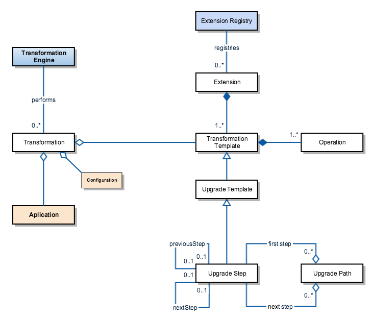
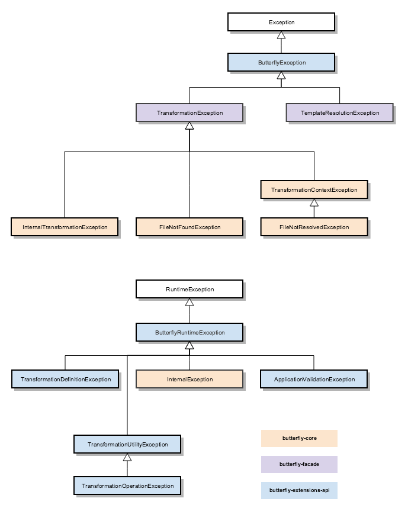

This page documents a few Butterfly design diagrams and notes.

This information is not intended for Butterfly users, but developers maintaining Butterfly source code. Extension developers might also benefit from it, although it's not necessary to develop extensions.

## Main components

1.	**butterfly-core**: contains Butterfly core functionality, such as extension registration, the transformation engine, besides reporting and metrics mechanisms. It also contains some basic transformation utilities
1.	**butterfly-utilities**: a set of basic transformation utilities and operations to manipulate different types of files, such as POM, properties, text, java, XML, and others
1.	**butterfly-cli**: command line interface so end users can perform transformations using Butterfly
1.	**butterfly-cli-package**: builds Butterfly zip file, used for installation purposes
1.	**butterfly-extensions-api**: extensions API, allowing third parties to develop transformation templates, custom transformation operations and transformation utilities
1.	**butterfly-façade**: the façade to be used when integrating with Butterfly programmatically

## Diagrams

The diagrams presented here are not detailed and precise, neither up-to-date to the latest commits, they are instead just a simple representation Butterfly design, intended as an overview of its architecture.

### Transformation simplified class diagram

### Exceptions simplified class diagrams

