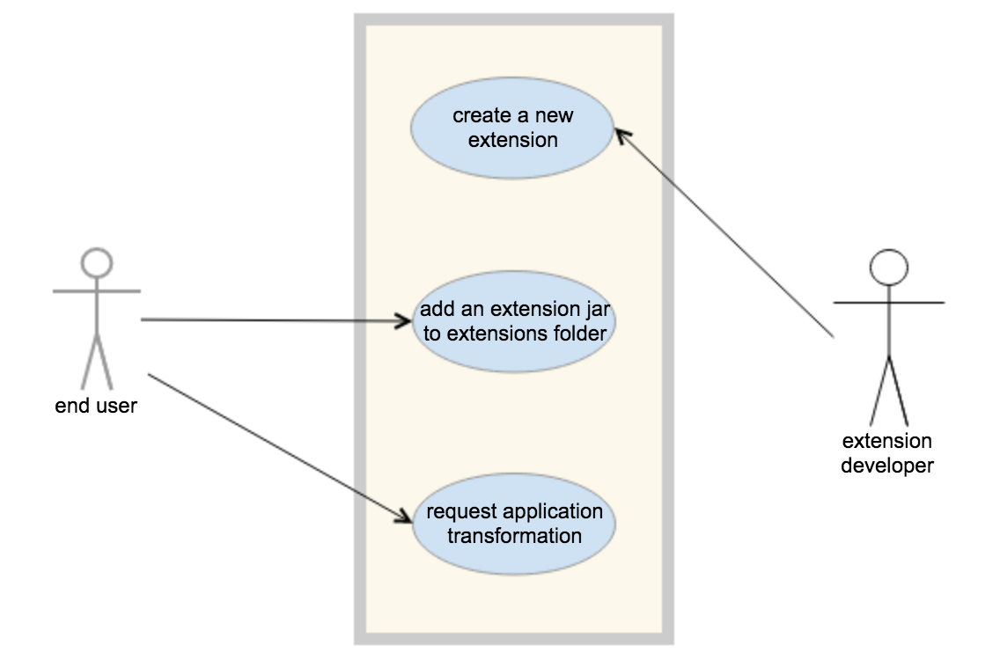
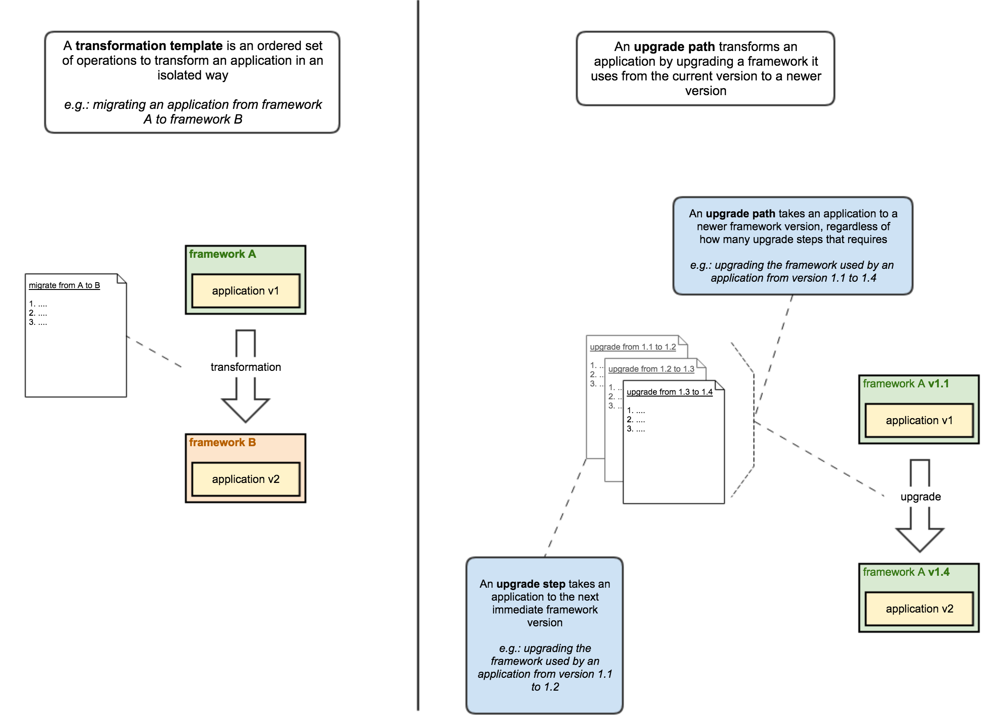
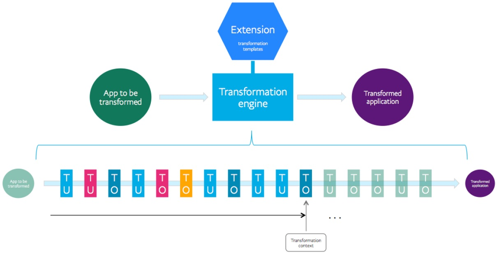

Butterfly extensions are third-party Butterfly packages containing transformation templates and/or upgrade templates.

This page documents Butterfly extensions API, allowing development of transformation templates, and also custom transformation utilities and operations.

## Use cases

## Butterfly terminology

1. **Application**: the application to be transformed
1. **Operation (AKA transformation operation, or TO)**: a single modification in an application (e.g. removing a file, or adding a new dependency into a pom file)
1. **Transformation template**: a set of operations to be applied against any application
1. **Transformation**: the act of applying a transformation template against a specific application, which results in a transformed application
1. **Migration**: there is nothing special in a migration, it is basically a transformation, and the fact that the result will be a migrated application is transparent to Butterfly (although it is relevant to the end user)
1. **Upgrade step**: a special type of transformation template that takes an application from one minor version to the next subsequent available version
1. **Upgrade path**: an ordered set of upgrade steps to take an application from one version to any newer version (including every upgrade step in between those two versions)
1. **Upgrade**: the act of applying an upgrade path against a specific application, which results in an upgraded application
1. **Butterfly input**: information about the application to be transformed and the transformation template to be applied
1. **Butterfly configuration**: configuration such as a specific output folder to plate the transformed application and to whether zip or not it
1. **Butterfly extension**: a third-party Butterfly package that contains transformation templates, upgrade templates and/or upgrade paths, besides also optionally validation implementations
1. **End user**: this is the person that uses Butterfly to transform an application (by using transformation templates within a particular extension)
1. **Extension developer**: this is the person that creates 3rd party Butterfly extensions, containing transformation templates and optionally also custom validations
1. **Validation**: there are two types of validations, "pre" and "post" transformation. The first make sure the application is eligible to be transformed, and the second makes sure the transformation was successful
1. **Butterfly transformation engine**: the mechanism that performs application transformations based on transformation templates
1. **Transformation pipeline**: sequence of transformation utilities (and operations) defined by the transformation template to be executed by the transformation engine
1. **Utility (AKA transformation utility, or TU)**: key Butterfly element, gathering data about the project to be transformed, without applying any modification on it
1. **Transformation context**: object shared among all utilities containing information about the application being transformed, as they are gathered by utilities, plus extra meta-data

## Differences between TO and TU

**Transformation Operation (TO)** is a specialized type of **Transformation Utility (TU)**.
Here are the differences between them:

1. TU never modifies application. TO always does.
1. TU usually returns a value, but not necessarily. TO never does.
1. TU usually saves its result in the transformation context object, but not necessarily. TO always does.
1. TO allows multiple operations

**Note**: terms "value" and "result" above are not the same. Value refers to an actual data that is obtained or generated by a TU and that can be useful for TUs and TOs to be executed. Result refers to the internal Butterfly meta-data type to represent the execution result of a TU or TO, for example, stating if it was successful, if it failed, if it was skipped, etc. Both value and result are stored in the transformation context.

## Transformation template types

The diagram below exemplifies the differences between transformation template and upgrade templates, besides representing also upgrade steps and upgrade paths.

## Transformation process and pipeline

The diagram below pictures the transformation process, whose core element is the transformation engine, which executes transformation templates defined in a particular extension, transforming the application.

The transformation is executed through a pipeline made of a sequence of transformation utilities (TU) operations (TO) defined by the transformation template.

Notice in the diagram below a horizontal line under the pipeline, showing which operation is being executed at the moment. Notice also that each utility or operation executed always has access to the transformation context, which is an object shared among all utilities containing information about the application being transformed, as they are gathered by utilities, plus extra meta-data.

The colors in the pipeline represent the possible states, meaning:

1. Light green: not performed yet
1. Dark blue: a successfully executed TO
1. Light blue: a successfully executed TU
1. Yellow: a TU or TO that has executed succesfully, but not without producing a warning
1. Red: a TU or TO that has executed resulting in a non-fatal error

## Running Butterfly CLI from an IDE

When developing a Butterfly extension, it is very helpful to be be able to run it from the IDE. To do so, add class-path entries for your extension jar and run class `com.paypal.butterfly.cli.ButterflyCliApp`, from `butterfly-cli` jar, passing the required command line arguments.

## Butterfly javadocs

Refer to the following javadocs to develop your own Butterfly extension:

1. [butterfly-extensions-api](): API component to be used by Butterfly extensions when providing their transformation and upgrade templates.
1. [butterfly-utilities](): multiple types of ready-to-use transformation utilities.
